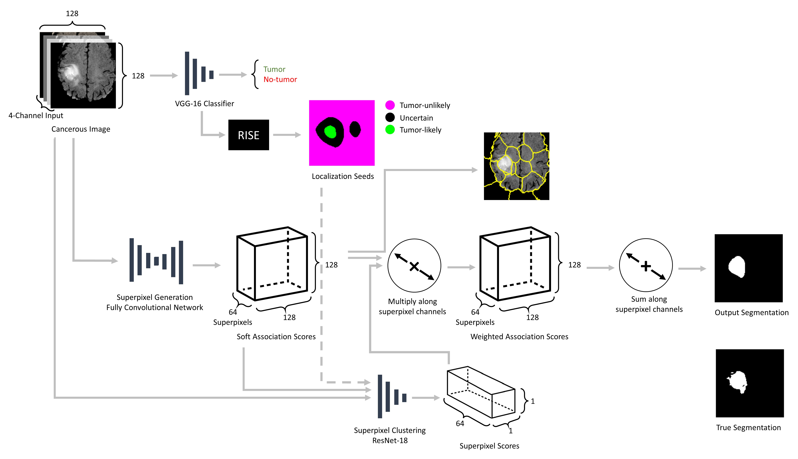

# Deep Superpixel Generation and Clustering for Weakly Supervised Segmentation of Brain Tumors in MR Images
Code for training and running weakly supervised brain tumor segmentation models using simultaneous superpixel generation and clustering.



Please see [Superpixel Generation and Clustering for Weakly Supervised Brain Tumor Segmentation in MR Images](https://arxiv.org/abs/2209.09930) for details.

If you use this code, please cite:
```
@misc{yoo2022superpixel,
      title={Superpixel Generation and Clustering for Weakly Supervised Brain Tumor Segmentation in MR Images}, 
      author={Jay J. Yoo and Khashayar Namdar and Farzad Khalvati},
      year={2022},
      eprint={2209.09930},
      archivePrefix={arXiv},
      primaryClass={cs.CV}
}
```

[](https://colab.research.google.com/github/JayJaewonYoo/BrainTumorWSS_Superpixels/blob/main/training_inference_example.ipynb) See the linked notebook for details on initializing, training, and performing inference using the models. 
